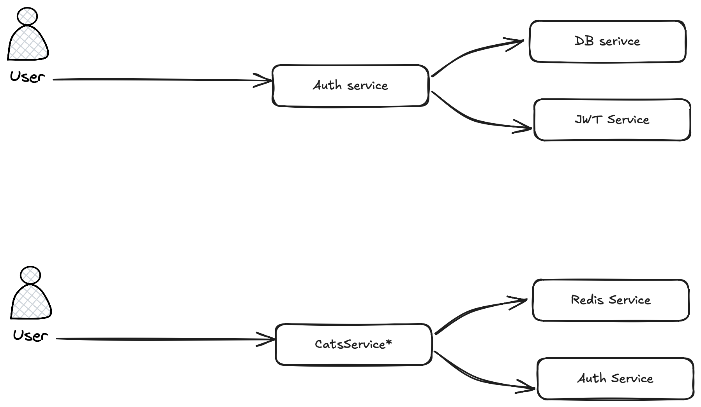

# FX Tutorial

## Running the tutorial

### Created a minimal application

The `New()` method of the fx object is where we set up our components/providers/dependencies,  
this returns an `*fx.App` struct, that we can call the `Run()` method on. It is a blocking method

### Adding a HTTP server & Register a Handler

So it seems the way it works, is that components are added into the `*fx.App` with the `fx.Provide` function.  
What I'm curious about is what qualifies for a components that needs to be provided. I am tempted to think about them  
like NestJs services, anything that can be a service would be provided. That would include

- Configurations
- Loggers
- Authentication

## Building something myself

So to test my understanding of this fx, I want to build a simple application that allows someone to sign up and login.  
A logged in user can make an authorised request to an external API, and the results are cached in redis.

### User stories

- A user would sign up on the system with a first name, last name email and password (hashed)
- A user would be able to log in with the email and password
- A logged in user would be able to make requests to external API
- The results of that request would be cached for each user

### System Design

The system would require the following "components" (NestJs Service)

- Authentication service
- Database Service
- Config Service
- Redis Service
- Service for the external API (yet to decide what this is)

